# Oil Tank Level Monitor

ESP32 + XKC-Y25-V non-contact liquid level sensor that sends Telegram alerts when your oil tank is running low. Includes a built-in web interface for configuration — no hardcoded credentials required.

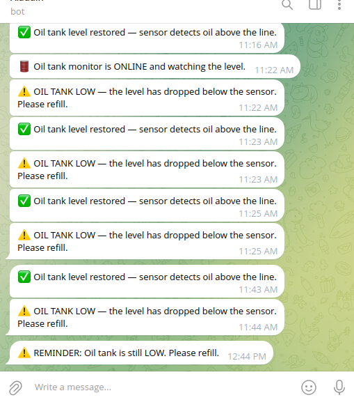

## What It Does

- **Web-based setup** — on first boot, creates a WiFi hotspot for configuration via your phone or laptop
- Monitors oil level using a non-contact capacitive sensor mounted on the sight glass
- Sends an immediate Telegram alert when oil drops below the sensor
- Sends hourly reminders until the tank is refilled
- Sends a confirmation message when the level is restored
- Supports up to 3 Telegram chat IDs — notify multiple people
- DHCP or static IP support, configurable from the web interface
- Password-protected web interface with session timeout
- OTA firmware updates via the web interface — no USB needed after initial flash
- Factory reset via web interface or by holding the BOOT button for 5 seconds
- All settings saved to flash — survives power cycles
- Auto-reconnects WiFi if the connection drops
- Debounced sensor readings to prevent false alerts
- **15-second hardware watchdog**: any infinite loop in the firmware auto-reboots the device. After recovery, a Telegram alert is sent so hangs do not go unnoticed.

## Hardware

| Component | Details | Price |
|-----------|---------|-------|
| ESP32 Dev Board | ESP-WROOM-32 with CP210x USB | [$9.99 (1-pack)](https://www.amazon.com/HiLetgo-ESP-WROOM-32-Development-Microcontroller-Integrated/dp/B0718T232Z) or [$17.99 (3-pack)](https://www.amazon.com/HiLetgo-ESP-WROOM-32-Bluetooth-ESP32-DevKitC-32-Development/dp/B0CNYK7WT2) |
| XKC-Y25-V Sensor | Non-contact capacitive liquid level sensor | [$8.34 (1-pack)](https://www.amazon.com/caralin-XKC-Y25-V-Non-Contact-Liquid-Induction/dp/B0FT2CG9B2) or [$15.99 (4-pack)](https://www.amazon.com/DEVMO-Non-Contact-Induction-Detector-XKC-Y25-V/dp/B07TB3KZX7) |
| ToF Module (VL53L1X) | Time-of-Flight distance sensor (for dry mechanical float gauges) | [~$3-5](https://www.adafruit.com/product/3317) |
| Jumper Wires | Female-to-female Dupont jumpers (or solder direct) | [$6.98](https://www.amazon.com/EDGELEC-Breadboard-Optional-Assorted-Multicolored/dp/B07GD2BWPY) |
| USB Power Adapter | Any 5V/1A USB adapter | ~$5 |
| USB Cable | Micro-USB **data** cable (not charge-only) | ~$5 |

**Total cost: under $30**

### Choosing a Sensor

The firmware supports three sensor types, selectable at runtime from the web interface:

- **Digital threshold** (default): single-threshold digital sensor on GPIO4. Designed for the XKC-Y25-V capacitive sensor on sight gauges containing actual liquid. Single notification: tank LOW / restored.
- **IR break-beam**: emitter/receiver pair on GPIO4, used to detect an opaque puck inside a dry mechanical-float sight gauge. Single notification: tank LOW / restored.
- **ToF distance** (VL53L1X): mounted on top of the sight gauge, measures distance to the puck and reports four states: LOW, BELOW_HALF, ABOVE_HALF, HIGH. Bidirectional notifications — get a heads-up when the tank passes half empty, plus refill confirmations at half and high marks.

Most installs with a working liquid sight gauge use the XKC-Y25-V. Dry mechanical-float gauges typically use either an IR break-beam or a ToF sensor like VL53L1X.

The web interface has a **Display Units** toggle (Metric / US Customary) that controls how distances are shown and accepted across the UI, the `/status` JSON poll, Telegram alerts, and the boot serial log. Internal storage is always in millimeters; the toggle only affects display and form-input layers, so switching units never changes the underlying configuration.

### ESP32 Dev Board

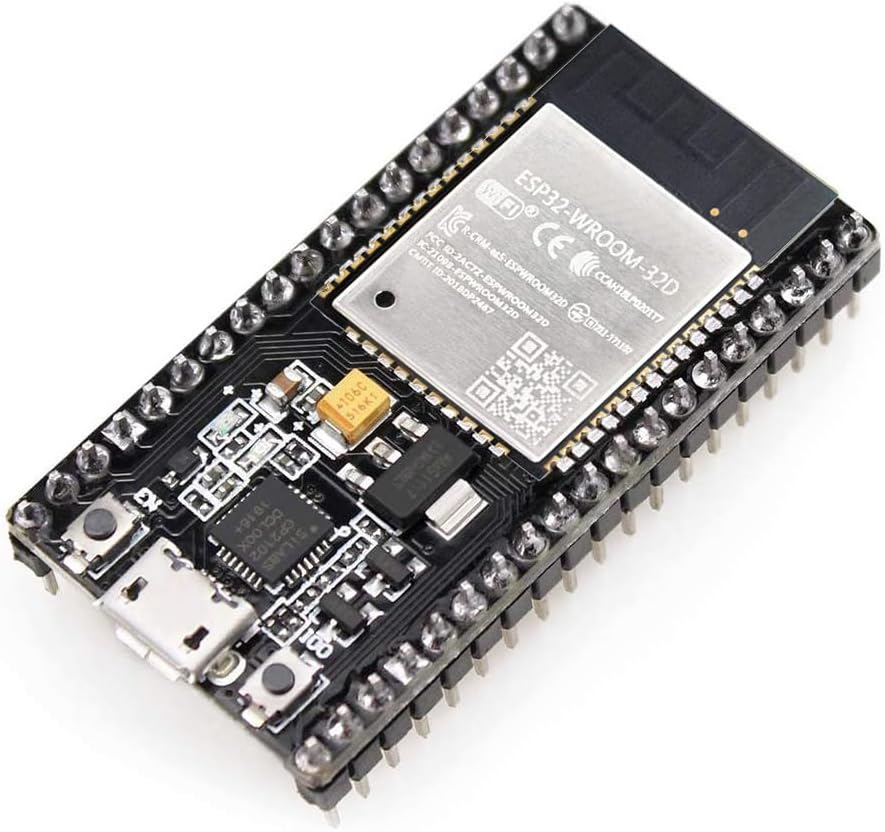

### ESP32 Pin Diagram

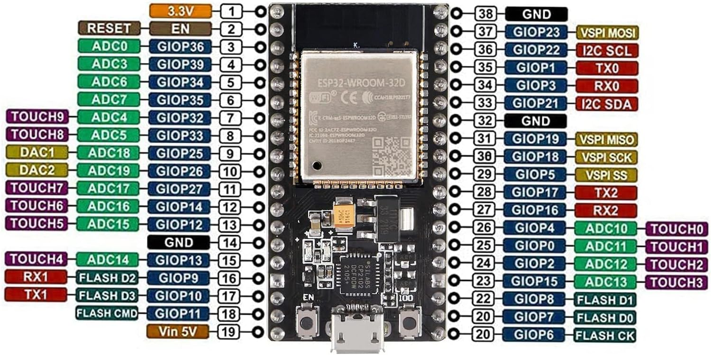

### XKC-Y25-V Liquid Level Sensor

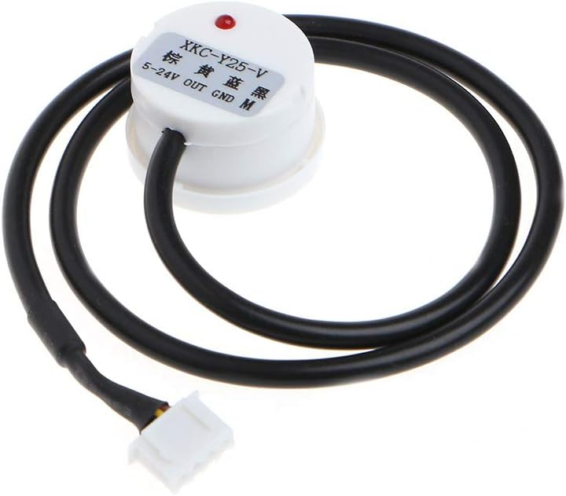

### Jumper Wires

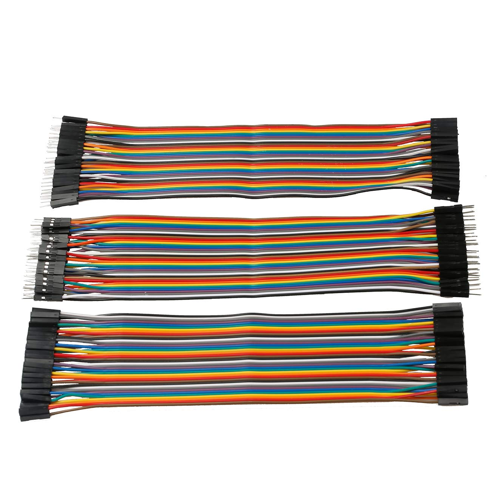

Female-to-female Dupont jumpers connect the sensor's three leads directly to the ESP32 header pins — no soldering or breadboard required.

### Wiring

| XKC-Y25-V Wire | ESP32 Pin |
|----------------|-----------|
| Brown | 3V3 (Pin 1) |
| Blue | GND (Pin 38) |
| Yellow | GPIO4 / D4 (Pin 26) |

Refer to the pin diagram above to locate the correct pins on your board.

#### IR Break-Beam Wiring

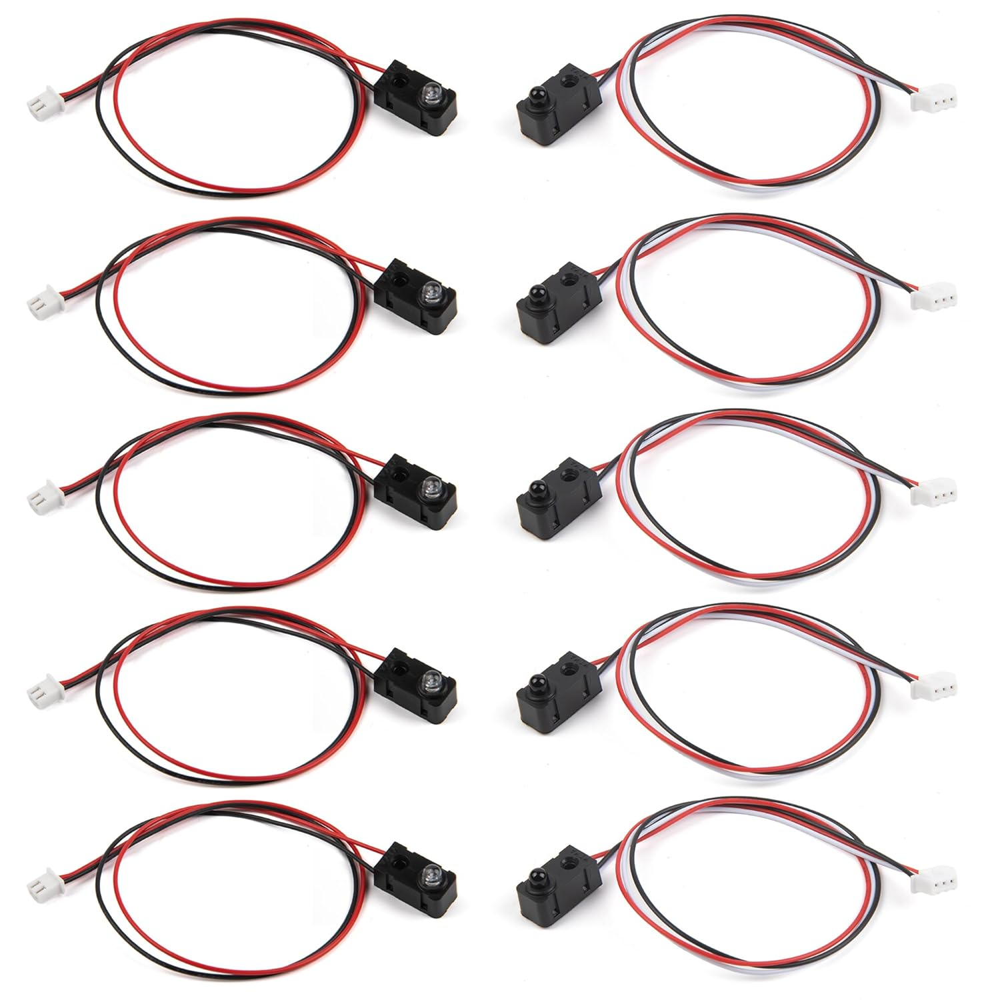

An IR break-beam pair is an emitter (red + black wires, power only) and a receiver (red + black + white wires, where white is the digital output). Mount them facing each other across the sight gauge so the opaque puck breaks the beam at low oil.

| IR Wire | ESP32 Pin |
|---------|-----------|
| Emitter — Red | 3V3 (Pin 1) |
| Emitter — Black | GND (Pin 38) |
| Receiver — Red | 3V3 (Pin 1) |
| Receiver — Black | GND (Pin 38) |
| Receiver — White (signal) | GPIO4 / D4 (Pin 26) |

The receiver pin is configured `INPUT_PULLUP` in firmware. HIGH = beam clear (oil present), LOW = beam broken (low oil).

#### ToF Sensor Wiring (VL53L1X)

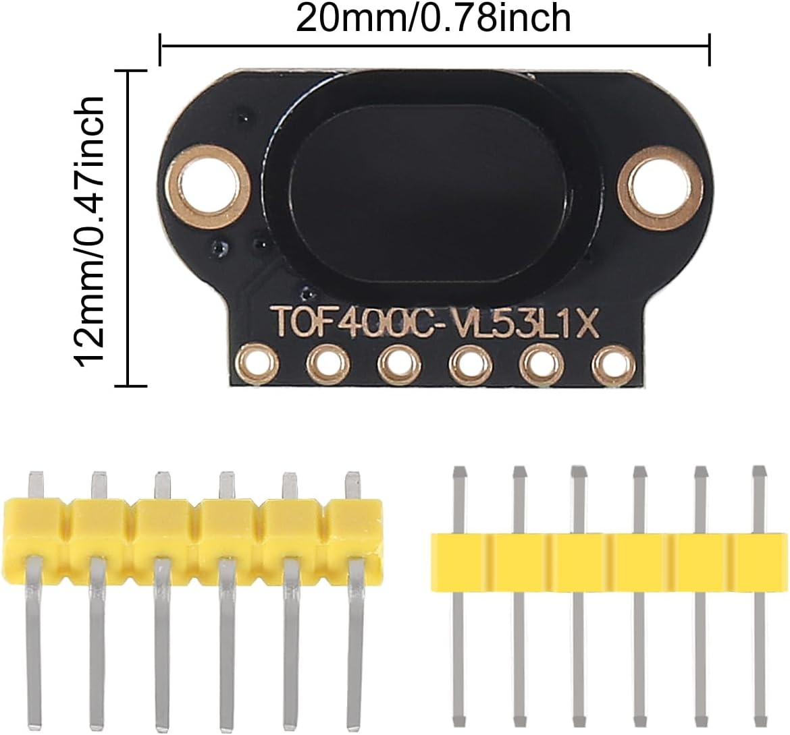

| ToF Pin (VL53L1X) | ESP32 Pin |
|-------------|-----------|
| VCC | 3V3 (Pin 1) |
| GND | GND (Pin 38) |
| SDA | GPIO21 (Pin 33) |
| SCL | GPIO22 (Pin 36) |

Mount the VL53L1X ToF sensor on top of the sight gauge looking down at the puck. The sensor reads distance — smaller value means the puck is near the top (fuller tank), larger value means it has dropped (emptier tank). VL53L1X provides ranging up to ~4 m. Threshold values can be entered in millimeters or in inches per the **Display Units** preference; storage is always in millimeters.

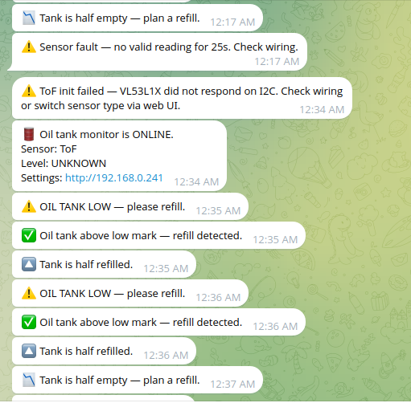

### Assembled Hardware

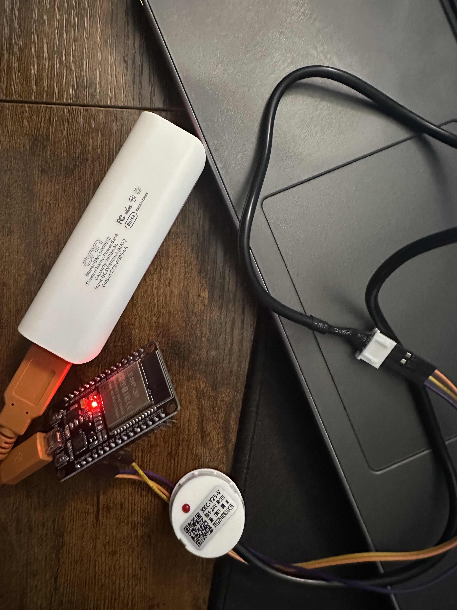

A complete build: ESP32 powered over USB with the XKC-Y25-V sensor wired in. The sensor's red LED lights when liquid is detected.

## Setup

### 1. Telegram Bot

1. Open Telegram and message [@BotFather](https://t.me/BotFather)
2. Send `/newbot` and follow the prompts to create your bot
3. Save the **bot token** it gives you
4. Message [@userinfobot](https://t.me/userinfobot) to get your **chat ID**
5. (Optional) Get chat IDs for up to 2 additional people to notify

### 2. Flash the ESP32

Using [Arduino CLI](https://arduino.github.io/arduino-cli/):

```bash
# Install ESP32 board support
arduino-cli config init
arduino-cli config add board_manager.additional_urls https://espressif.github.io/arduino-esp32/package_esp32_index.json
arduino-cli core update-index
arduino-cli core install esp32:esp32

# Install libraries
arduino-cli lib install "UniversalTelegramBot"
arduino-cli lib install "ArduinoJson"
arduino-cli lib install "Adafruit_VL53L1X"

# Compile and upload
arduino-cli compile --fqbn esp32:esp32:esp32 OilTankMonitor
arduino-cli upload --fqbn esp32:esp32:esp32:UploadSpeed=115200 --port /dev/ttyUSB0 OilTankMonitor
```

Or use the [Arduino IDE](https://www.arduino.cc/en/software) — add the ESP32 board manager URL in Preferences, install the ESP32 board package, install the UniversalTelegramBot and ArduinoJson libraries, and upload.

### 3. Configure via Web Interface

1. On your phone or laptop, connect to WiFi network **`OilMonitor-Setup`** (password: `oiltank123`)
2. Open a browser and go to **http://192.168.4.1**
3. Enter your WiFi network name and password
4. Enter your Telegram bot token and chat ID(s)
5. Optionally configure a static IP instead of DHCP
6. Set a web interface password (default: `admin` / `admin`)
7. Under **Sensor Configuration**, choose your sensor type:
   - **Digital threshold**: leave defaults — works with XKC-Y25-V, IR break-beam, etc. on GPIO4
   - **ToF distance**: enter LOW, HALF, and HIGH thresholds in mm (defaults: 200/130/60). The page shows a live distance reading once the sensor is wired — use this to determine your install-specific values
8. Click **Save & Restart**

The device will reboot, connect to your WiFi, and send a Telegram message confirming it's online — including its IP address for future access to the settings page.

#### Mobile Setup Screens

| WiFi & Telegram | Network, Password & Firmware |
|-----------------|-------------------------------|
| 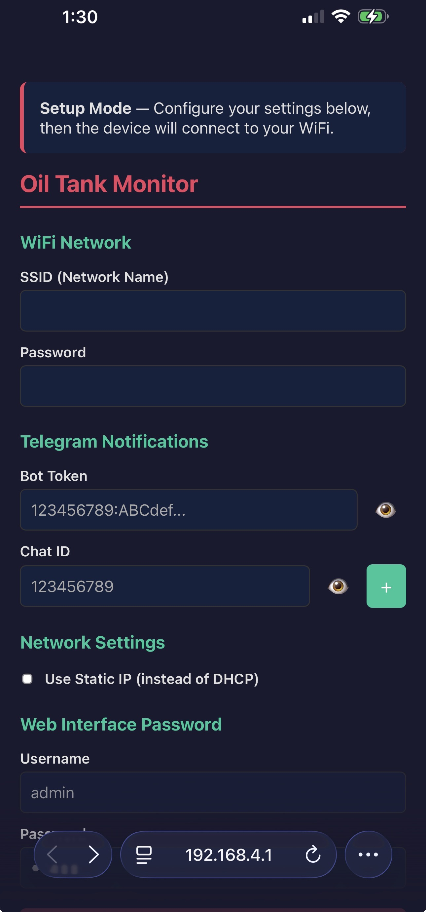 | 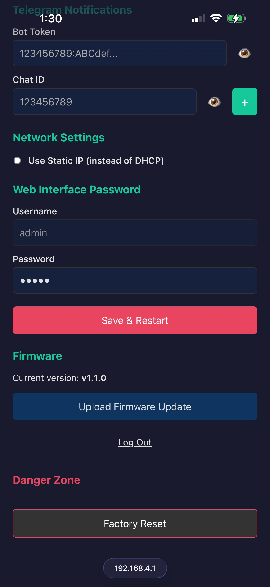 |

The setup portal at `http://192.168.4.1` is mobile-friendly — phone, tablet, or laptop all work.

### 4. Install

1. Attach the XKC-Y25-V sensor to the sight glass tube at your desired low-level threshold
2. Power the ESP32 from a USB adapter near the tank
3. Keep the USB cable under 5 meters — if you need more distance, use a longer extension cord to the adapter instead

#### Portable / Backup Power

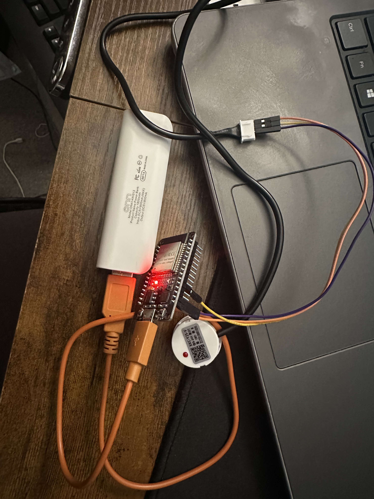

The ESP32 runs on any 5V USB source, so a power bank works for bench testing or short outages. For permanent install, use a wall adapter — the always-on web portal will drain a typical 10,000 mAh bank in roughly 1–2 days.

### Reconfiguring

You can access the settings page at any time by visiting the device's IP address in a browser (login: `admin` + your password). If the device can't connect to WiFi (e.g. after a network change), it will automatically fall back to AP mode so you can reconfigure.

## Web Interface Features

- **Session-based authentication** with 15-minute inactivity timeout
- **Sensitive fields** (bot token, chat IDs) are masked by default with eye toggle to reveal
- **OTA firmware updates** — upload a `.bin` file to update without USB
- **Factory reset** — from the web interface (with confirmation) or by holding the BOOT button 5 seconds
- **DHCP/Static IP toggle** — configure network settings from the browser
- **Auto-redirect** — after saving settings or updating firmware, the page counts down and redirects back

## API

The device exposes a JSON status endpoint:

```
GET http://<device-ip>/status
```

Returns:
```json
{
  "oil_low": false,
  "wifi_connected": true,
  "ip": "192.168.1.100",
  "ssid": "YourNetwork",
  "uptime_sec": 3600,
  "firmware": "2.0.0",
  "sensor_type": "tof",
  "sensor_valid": true,
  "level": "ABOVE_HALF",
  "distance_mm": 110,
  "thresholds": { "low": 200, "half": 130, "high": 60 }
}
```

For digital sensor installs: `sensor_type: "digital"`, `level: "LOW"` or `"HIGH"`, and `distance_mm` / `thresholds` are omitted. The legacy `oil_low` field is preserved across both sensor types for backward compatibility.

## Sensor Notes

The XKC-Y25-V is a capacitive sensor that detects liquid through glass without any contact with the fluid. It outputs HIGH when liquid is present and LOW when absent. The firmware includes a 3-read debounce to prevent false triggers from sloshing or vibration.

### How the Sensor Reads Liquid

| Liquid above sensor (HIGH) | Liquid below sensor (LOW) |
|----------------------------|----------------------------|
| 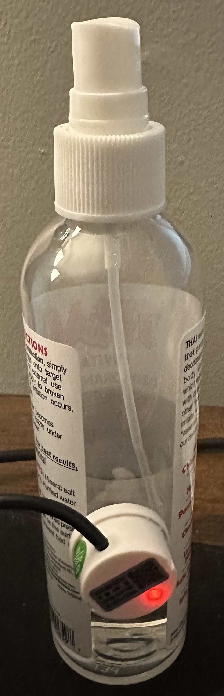 |  |
| Red LED on, signal HIGH, oil **present** — no alert. | LED off, signal LOW, oil **absent** — Telegram alert triggers after debounce. |

If your sensor variant has inverted logic (LOW = liquid present), change this line in the sketch:

```cpp
bool noLiquid = digitalRead(SENSOR_PIN) == LOW;
```

to:

```cpp
bool noLiquid = digitalRead(SENSOR_PIN) == HIGH;
```

## Configuration

These constants in the sketch can be adjusted:

| Constant | Default | Description |
|----------|---------|-------------|
| `SENSOR_PIN` | `4` (GPIO4) | GPIO pin connected to sensor signal wire |
| `ALERT_INTERVAL_MS` | `3600000` (1 hour) | How often to re-send low-oil reminders |
| `SENSOR_CHECK_MS` | `5000` (5 sec) | How often to read the sensor |
| `DEBOUNCE_COUNT` | `3` | Consecutive same-readings required before acting |
| `SESSION_TIMEOUT_MS` | `900000` (15 min) | Web interface session inactivity timeout |

## Contributing

Contributions are welcome. Some ideas:

- Multiple sensor support for different tank levels (e.g. low, critical)
- Battery-powered deep sleep mode
- MQTT integration for Home Assistant
- Level history logging and graphing on the web interface
- Temperature compensation for sensor accuracy
- Email or SMS notifications as an alternative to Telegram
- Percentage-based level estimation with multiple sensors

Fork the repo, make your changes, and open a pull request.

## License

[MIT](LICENSE)
